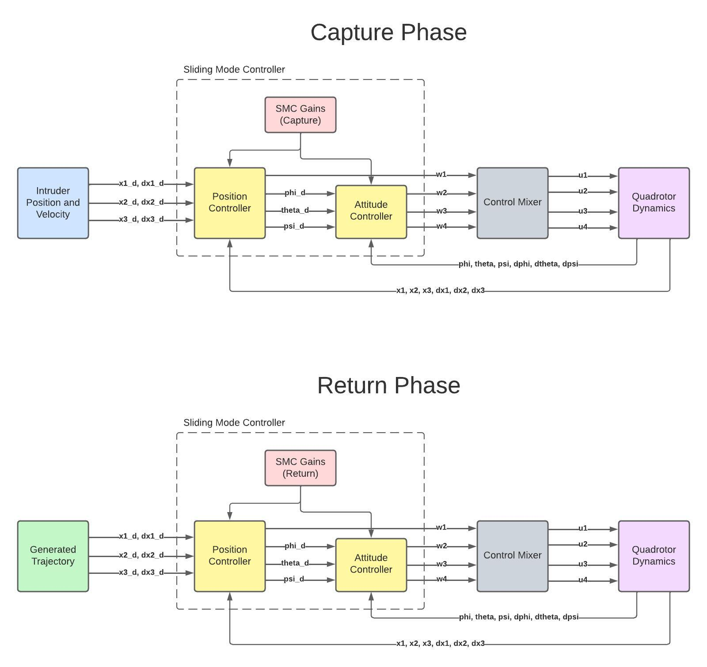

# Sliding-Mode-Control-for-Quadrotor-Sentry
This repository contains a project completed at Worcester Polytechnic Institute for the RBE-502 Robot Control course.

# System Diagram

# Overview
The project involves the use of SMC for a quadrotor sentry capable of capturing an intruder and returning to its initial position. The project leveraged sliding mode control as the primary method for controlling the quadrotor's behavior.

Sliding mode control is a robust control technique that is particularly well-suited for systems with uncertainties and disturbances. It involves creating a control system that guides the system's state trajectory onto a predefined manifold, known as the sliding surface, and then maintaining the system's state on this surface to achieve the desired behavior.

In the context of the quadrotor sentry project, the sliding mode control was used to enable the quadrotor to perform precise and agile maneuvers for capturing the intruder while ensuring stability and robustness in the face of external disturbances. The control code would have been designed to calculate the appropriate control inputs based on the quadrotor's state and the desired trajectory, allowing it to execute the capture and return mission effectively.

The use of sliding mode control in this project demonstrates a sophisticated approach to addressing the control challenges associated with quadrotor dynamics and mission-specific requirements. It showcases the application of advanced control techniques in the context of autonomous robotic systems, highlighting the intersection of theoretical concepts with practical implementation in real-world scenarios.
